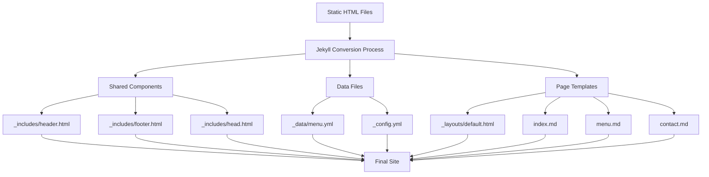

# System Patterns - Jekyll Static Site Architecture

## Core Architecture Pattern
**Component-Based Jekyll Site with Data Separation**



## Key Design Patterns

### 1. DRY (Don't Repeat Yourself) Pattern
- **Header/Footer**: Single source in `_includes/` used across all pages
- **Navigation**: Defined once in `_config.yml`, rendered everywhere
- **Contact Info**: Stored in `_config.yml`, used in multiple places

### 2. Data-Driven Content Pattern
- **Menu**: Extracted to `_data/menu.yml` for easy editing
- **Configuration**: Site-wide settings in `_config.yml`
- **Template Loops**: Use Jekyll's `` to render data

### 3. Layout Inheritance Pattern
- **Base Layout**: `_layouts/default.html` with `{{ content }}`
- **Page Content**: Individual `.md` files specify layout in frontmatter
- **Component Inclusion**: `` tags for shared elements

## File Organization Strategy

### Required Structure:
```
/
├── _config.yml          # Site configuration
├── _data/
│   └── menu.yml         # Editable menu data
├── _includes/           # Shared components
│   ├── head.html        # Meta tags, fonts, scripts
│   ├── header.html      # Site header with nav
│   └── footer.html      # Site footer
├── _layouts/
│   └── default.html     # Base page template
├── *.md                 # Page content files
├── Gemfile              # Ruby dependencies
├── .gitignore           # Git exclusions
└── README.md            # Setup instructions
```

## Component Communication Pattern

### Configuration Flow:
1. `_config.yml` → Available as `site.*` in all templates
2. Page frontmatter → Available as `page.*` in templates  
3. `_data/menu.yml` → Available as `site.data.menu.*`

### Template Rendering:
1. Jekyll reads `.md` file with layout specification
2. Processes frontmatter and content through Liquid
3. Wraps content in specified layout
4. Includes shared components via ``
5. Outputs static HTML

## Styling Architecture
- **Primary**: Tailwind CSS via CDN for consistency with original design
- **Fonts**: Google Fonts (Plus Jakarta Sans, Noto Sans)
- **Colors**: Predefined color palette from original design
- **Responsive**: Mobile-first approach with breakpoint classes

## GitHub Pages Integration
- **Automatic Building**: Jekyll builds triggered on git push
- **Zero Config**: No build pipeline setup required
- **Custom Domain**: CNAME file support
- **SSL**: Automatic certificate provisioning
